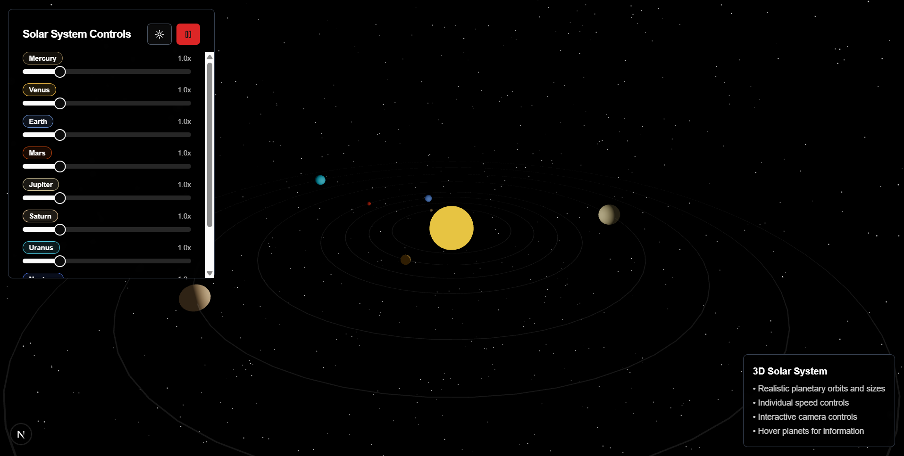

# 🌌 3D Solar System Simulator

An interactive, visually stunning 3D Solar System built with **Next.js**, **Tailwind CSS**, and **Three.js**, featuring configurable rotation speeds for each planet.

 

---

## 🚀 Features

* 🌍 Realistic 3D rendering of planets and the sun
* 🔁 Adjustable planet rotation speeds
* 💡 Built with performant and modern web technologies
* 📱 Fully responsive design using Tailwind CSS
* ⚡ Blazing fast dev experience with `pnpm`

---

## 🛠️ Tech Stack

* [Next.js](https://nextjs.org/) – Framework for React
* [Tailwind CSS](https://tailwindcss.com/) – Utility-first CSS
* [Three.js](https://threejs.org/) – 3D graphics in the browser
* [pnpm](https://pnpm.io/) – Fast and disk space-efficient package manager

---

## 📦 Installation

> Make sure you have **Node.js** and **pnpm** installed.

```bash
git clone https://github.com/anushthakumari/solar-system-3d-3js.git
cd 3d-solar-system
pnpm install
```

---

## 🧪 Development

```bash
pnpm dev
```

Visit `http://localhost:3000` to view the app in your browser.

---

## 🏗️ Build for Production

```bash
pnpm build
pnpm start
```

---

## ⚙️ Customization

You can configure the **rotation speed** of each planet using a simple control panel in the UI or directly modify the parameters in the corresponding Three.js components.

---

## 🙌 Contributing

Pull requests and feedback are welcome!
If you have ideas to improve the simulation, feel free to open an issue or PR.

---